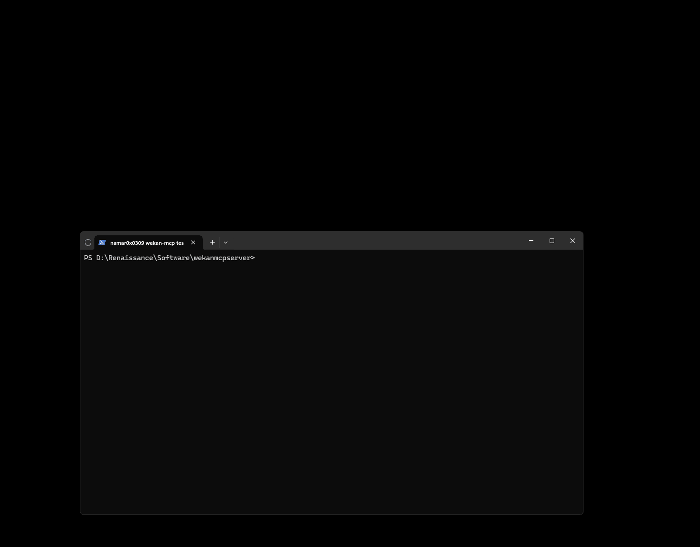

# Wekan MCP Server

made by namar0x0309 with ❤️ at GoAIX



This project includes scripts to automatically generate Wekan API tokens and configure your environment.

## Getting Started

### Generate Wekan API Token

Run the appropriate script for your platform to generate your API token:

**Windows (PowerShell):**
```powershell
./get-wekan-token.ps1
```

**Linux/macOS (Bash):**
```bash
./get-wekan-token.sh
```

The script will prompt you for:
- Wekan endpoint (e.g., https://wekan.namar0x0309.com)
- Username
- Password

After successful authentication, it will:
1. Generate an API token
2. Create or update the `.env` file with your token and configuration

### Manual Configuration

If you prefer to configure manually, copy `.env.example` to `.env` and fill in your details:

```bash
cp .env.example .env
```

Then edit the `.env` file with your Wekan instance details and API token.

## Environment Variables

The `.env` file contains:

- `WEKAN_BASE_URL`: Your Wekan instance URL
- `WEKAN_API_TOKEN`: Generated API token for authentication
- `WEKAN_USER_ID`: Your Wekan user ID
- `WEKAN_TOKEN_EXPIRES`: Token expiration date

## Testing

You can test your configuration by running:

```bash
node test-auth.js
```

This will verify that your API token is working correctly.

## Development

### MCP Inspector

For development and debugging the MCP server, you can use the MCP Inspector:

```bash
npm run inspect
```

This will launch the MCP Inspector with the configuration from `mcp-inspector-config.json`.

For development with automatic rebuilding:

```bash
npm run inspect:watch
```

This will build the project and launch the inspector, automatically rebuilding when changes are detected.
