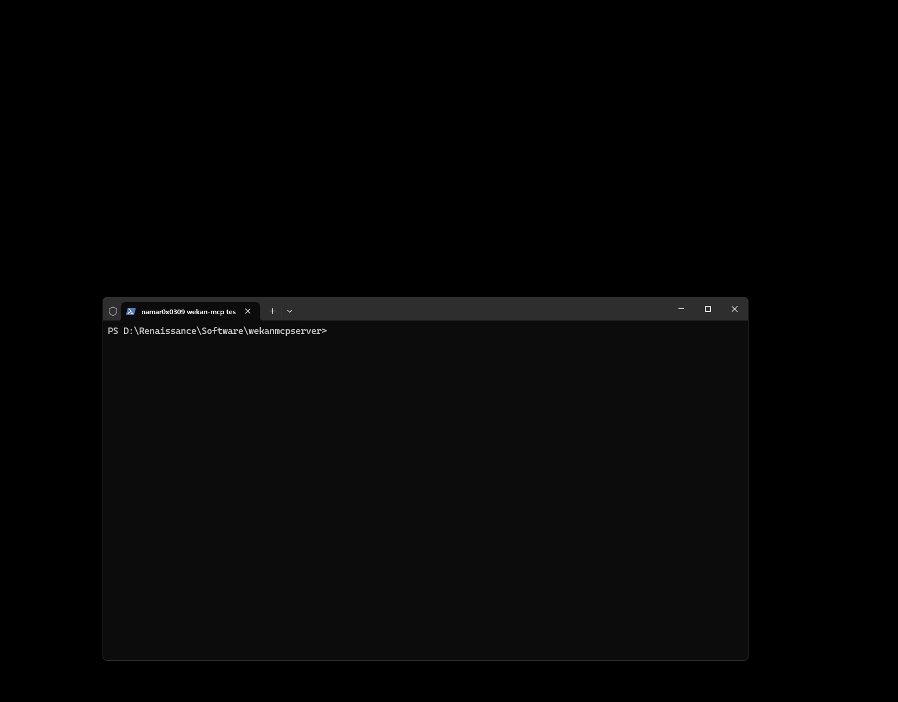

# Wekan MCP Server

made by namar0x0309 with ❤️ at GoAIX



This project includes scripts to automatically generate Wekan API tokens and configure your environment.

## Supported Agent Functionality

The Wekan MCP Server provides the following tools for AI agents to interact with Wekan:

### Board Management
- **listBoards** - List all accessible Wekan boards available to the authenticated user

### List Management
- **listLists** - List all lists within a specific board

### Swimlane Management
- **listSwimlanes** - List all swimlanes in a board (used for organizing cards vertically)

### Card Management
- **listCards** - List all cards in a specific board and list
- **createCard** - Create a new card with support for:
  - Title (required)
  - Description (optional)
  - Swimlane assignment (optional)
  - Due date (optional, ISO 8601 datetime format)
  - Team members (optional, array of user IDs)
  - Labels (optional, array of label IDs)
- **moveCard** - Move a card to another list or swimlane within the same board

### Card Interaction
- **commentCard** - Add a comment to an existing card

## Getting Started

### Generate Wekan API Token

Run the appropriate script for your platform to generate your API token:

**Windows (PowerShell):**
```powershell
./get-wekan-token.ps1
```

**Linux/macOS (Bash):**
```bash
./get-wekan-token.sh
```

The script will prompt you for:
- Wekan endpoint (e.g., https://wekan.namar0x0309.com)
- Username
- Password

After successful authentication, it will:
1. Generate an API token
2. Create or update the `.env` file with your token and configuration

### Manual Configuration

If you prefer to configure manually, copy `.env.example` to `.env` and fill in your details:

```bash
cp .env.example .env
```

Then edit the `.env` file with your Wekan instance details and API token.

## Environment Variables

The `.env` file contains:

- `WEKAN_BASE_URL`: Your Wekan instance URL
- `WEKAN_API_TOKEN`: Generated API token for authentication
- `WEKAN_USERNAME`: Your Wekan username (alternative to API token)
- `WEKAN_PASSWORD`: Your Wekan password (alternative to API token)
- `WEKAN_USER_ID`: Your Wekan user ID
- `WEKAN_TOKEN_EXPIRES`: Token expiration date

**Note:** You can authenticate using either:
1. `WEKAN_API_TOKEN` - Pre-generated token, or
2. `WEKAN_USERNAME` and `WEKAN_PASSWORD` - For automatic token generation on each request

## Testing

You can test your configuration by running:

```bash
node test-auth.js
```

This will verify that your API token is working correctly.

You can also test all available methods:

```bash
node test-all-methods.js
```

## Development

### MCP Inspector

For development and debugging the MCP server, you can use the MCP Inspector:

```bash
npm run inspect
```

This will launch the MCP Inspector with the configuration from `mcp-inspector-config.json`.

For development with automatic rebuilding:

```bash
npm run inspect:watch
```

This will build the project and launch the inspector, automatically rebuilding when changes are detected.
